<style>
.small-code pre code {
  font-size: 1em;
}
.footer {
    color: black; background: #E8E8E8;
    position: fixed; top: 90%;
    text-align:center; width:100%;
}
.reveal h1, .reveal h2, .reveal h3 {
  word-wrap: normal;
  -moz-hyphens: none;
}
.midcenter {
    position: fixed;
    top: 50%;
    left: 50%;
}
</style>

Analysis of the Heart Data
==========================
author: Aliyu Sambo, Kamau Maina, Julian Hatwell and Paul Carter
date: 
autosize: true
font-import: http://fonts.googleapis.com/css?family=Ubuntu
font-family: 'Ubuntu'

Introduction
============


- Why we chose the heart data
- Exploratory Data Analysis (EDA)
- Pre-processing
- Descriptive / Predictive Analyses

EDA Data Summary
============
There are 303 rows and 14 columns (excluding column X).

<div align="center">

</div>

EDA Categorical Variables
=========================

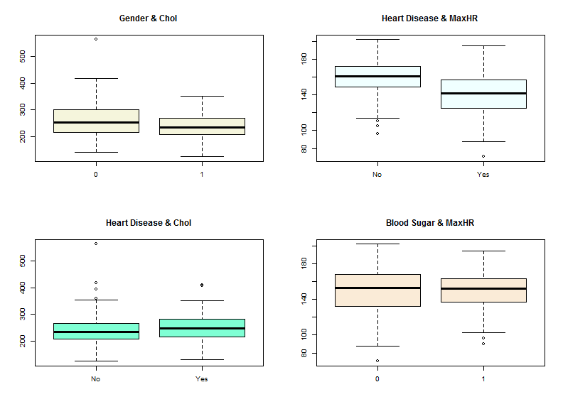

EDA Distribution of numeric vars
===================================

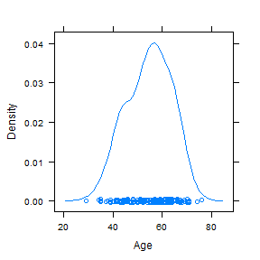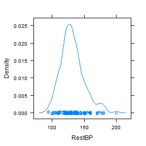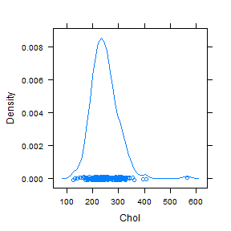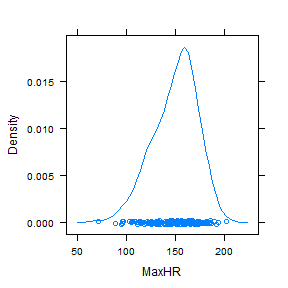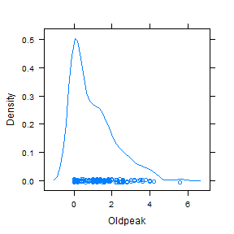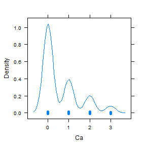

EDA Multivariate Distribution
=============================

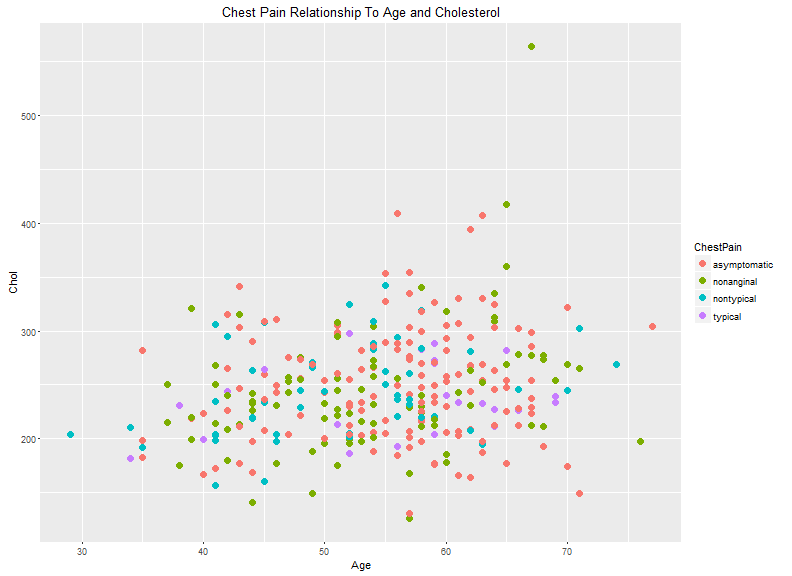

Preprocessing
=============
1. Drop variable X and rename AtheroscleroticHDisease
1. Recoding factors
1. Partition the data into training and test
1. Handling NA values in Thal variable
1. Handling NA values in Ca variable
1. Handling outlier in Chol variable
1. Handling skew in Oldpeak variable
1. Scaling numeric variables

NA Values
=========

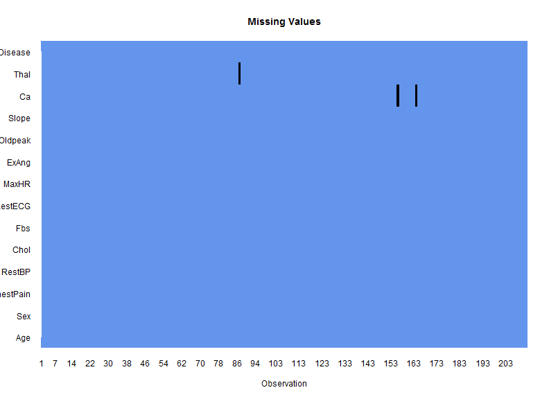

Handling NA values in Thal variable
===================================


```r
library(Hmisc) # impute with mean/mode etc.
heart.train$Thal <- impute(heart.train$Thal, mode) # mode is "normal"
```

Handling NA values in Ca variable
=================================


```r
sum(is.na(heart.train$Ca)) # before
```

```
[1] 2
```

Handling NA values in Ca variable
=================================


```r
library(VIM)
heart.imputn <- heart.train[!is.na(heart.train$Ca),]
imputn.rows <- nrow(heart.imputn)
heart.NA <- heart.train[is.na(heart.train$Ca),]
heart.imp.NA <- rbind(heart.imputn, heart.NA)

hearttemp <-kNN(heart.imp.NA, "Ca")[,-15]

toputback <- hearttemp[-c(1:imputn.rows), ]
heart.train <- heart.train[!is.na(heart.train$Ca),]
heart.train <- rbind(heart.train, toputback)
```

Handling NA values in Ca variable
=================================

```r
sum(is.na(heart.train$Ca)) # after
```

```
[1] 0
```

Handling outlier in Chol variable
=================================

<div class="footer" style="margin-top:-50px;font-size:80%;">
The Chol data has an outlier that is far removed from the next closest data point. This may have been an input error. It was therefore excluded from the analysis.</div>
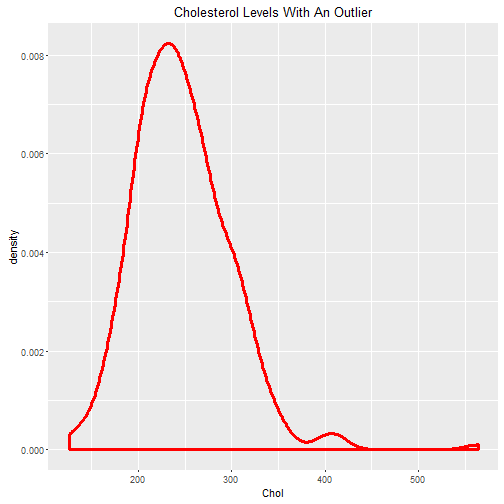
***
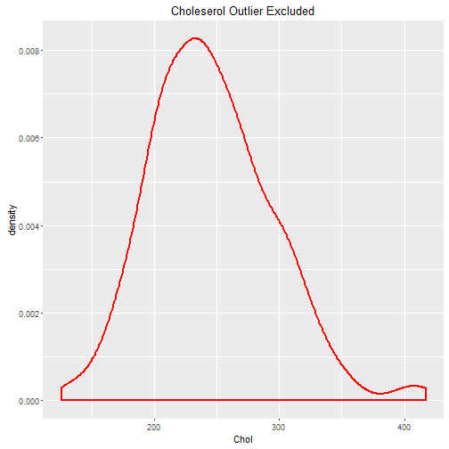

Handling skew in Oldpeak variable
=================================
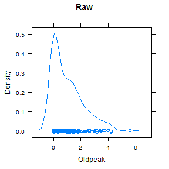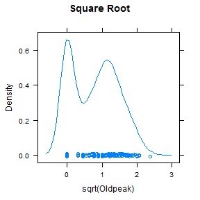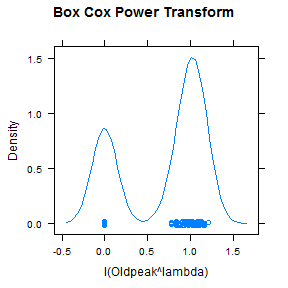

We chose square root as it is good enough and easier to explain to non-statisticians.

Predictive and Descriptive Analyses
===================================

Each team member will now present a summary of their individual investigation

Using Clustering to Investigate the link between Heart Disease and Chest Pain
============================
Julian Hatwell

Heart Disease and Chest Pain
============================
<div align="center">

</div>

Heart Disease and Chest Pain
============================
- Question: Is there an underlying set of metabolic indicators associated with the pattern seen in the symptoms?

- Methodology: Remove the two variables describing the symptoms and use clustering to look for a pattern in the remaining variables.

- $k \in \{2, 4\}$ or dendrogram cut at 2 or 4 nodes makes sense intuitively.

Heart Disease and Chest Pain
============================
<div align="center">

</div>

Heart Disease and Chest Pain
============================
<div align="center">

</div>

Heart Disease and Chest Pain
============================
<div align="center">

</div>

Heart Disease and Chest Pain
============================
<div align="center">

</div>

Using Clustering to Investigate the link between Blood Sugar and Cholesterol
=============================
Kamau Maina

Initial Visualisation
========================================================
<div class="footer" style="margin-top:-40px;font-size:80%;">
To understand the Fasting Blood Sugar date.<br>
False: Fastin Blood Sugar level below 120 mg/dl<br>
True: Fasting Blood Sugar level above 120 mg/dl</div>
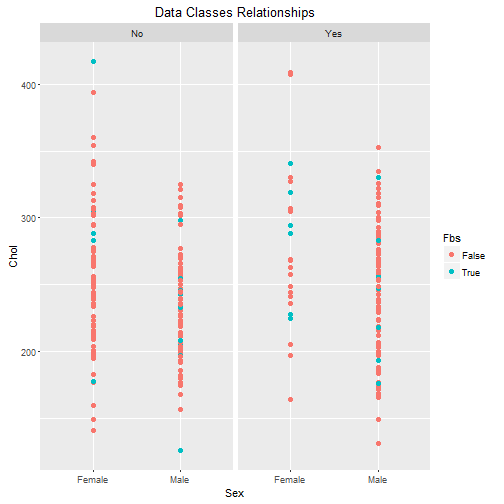

K-Means Clustering
========================================================
<div>
<div align="center">

</div>
***
<div align="center">

</div>
</div>
<div class="footer" style="margin-top:-50px;font-size:80%;">
K-Means clustering clusters the data into different groups as the actual groups. This suggests that there is more that causes heart disease besides the variables at our disposal.
</div>


Hierarchical Clustering
=======================
<div align="center">

</div>
4 selected clusters are colored. Datum are colored by heart disease.

Variable Density Heatmap
========================
<div align="center">

</div>
A heatmap of the density of each unique datum per variable

Prediction of Blood Sugar Levels - a class imbalance problem
=======================
Aliyu Sambo

Initial Naive Bayes Predictive Analysis Result
==============================================

Initial Naive Bayes prediction performance for Fbs (Fasting Blood Sugar) was poor.

<div align="center">

</div>

Initial kNN  Predictive Analysis Result
=======================================

kNN model prediction for Fbs showed very poor performance and predict all as false.

<div align="center">

</div>

Improvement Efforts
===================

Feature Selection: The RELIEF and RELIEFCAT algorithms were used to identify features that features that were key.

<div align="center">

</div>

Using only key attributes did not give significant difference.

Improvement Efforts (Contd)
===========================

- Optimising K parameter 


```r
round(sqrt(nrow(heart.train)))
```

```
[1] 15
```

Therefore tried k= c(7, 9, 11, 13, 15, 17, 19). k=13 was used.

- Rescaling of Numeric Attribute
- Binning of Numeric Attributes and apply knncat (knn categorical)

Identified Main Cause of Poor Performance
=========================================

'Class Imbalance' of Fbs identified. 
Ideal for predictive models is close to 50% by 50%.


```r
table(heart$Fbs)
```

```

  0   1 
258  45 
```

```r
table(heart$HDisease)
```

```

 No Yes 
164 139 
```

Solution
========
There are two class imbalance mitigation approaches:
- Cost function based approaches
- Sampling based approaches: Oversampling/Undersampling/Hybrid

Oversampling (adding more of the minority class) was implemented using a function in ROSE package.

<div align="left">

</div>

Result After Mitigating for Class Imbalance
===========================================
<div align="center">

</div>

Increasing classifier performance using data categorisation
==============
Paul Carter

NaiveBayes with "Raw" Heart Dataset 
===================================
<div align="center">
 <br />
</div>

Categorising Variables 
======================
Now let's see if the performance is better with other categorised columns 

- Age from 41 values => 7 (<40, {41-46}, {47-52}, {53-58}, {59-64}, {65-70}, 71+)
- RestBP from 50 Values => 4 (Low, Ideal, Pre-High & High)
- Chol from 152 Values => 3 (Desirable, Borderline-High, High)
- MaxHR from 91 Values => 2 (Average, High)

=========================================================

<div align="center">

</div>


Categorising Variables 2
========================

<div align="center">


</div>

- A fully categorised RestBP variable 


Analysing NaiveBayes
====================

```r
NBClassifier.alt <- naiveBayes(HDisease ~., data = NBdata3)
NBClassifier.alt
```
<div align="center">

</div>

- Those aged between 53-58 are at the highest risk of developing heart disease

Analysing Results 2
===================
<div align="center">
 
  
 
 
 
 
</div>


Categorising Results (NaiveBayes)
=================================


<div align="center">


</div>

- Decreased Accuracy
- Higher Sensitivity 

KNN Results 
===========
- KNN improved performance against "raw" heart data set (72.1%)
- However performed worse against NaiveBayes

<div align="center">


</div>


Converting KNN to Integer + Rescaling 
=====================================

<div align="center">

</div>

Feature Selection
=================

```r
library(mlbench)
weights <- chi.squared(HDisease~., KNNdata3)
print(weights)
```

<div align="center">

</div>

<div align="center">

</div>

Final Words
===========

Any Questions?

Thanks for your attention
